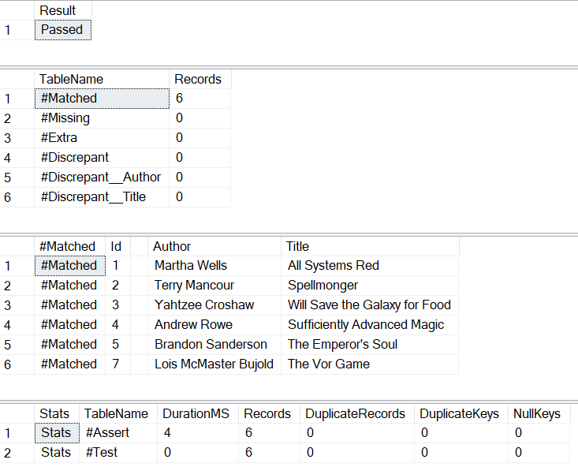

- [Sql Data Compare](#sql-data-compare)
  - [Using the App](#using-the-app)
  - [Privacy and Security](#privacy-and-security)
  - [Support](#support)
  - [Requirements](#requirements)

# Sql Data Compare

This application provides a simple, free option for generating Sql Server scripts which you can then run to compare data returned by any two sql queries. Those queries may be a single select statement using one or more tables, or they be more complex and involve temp tables or common table expressions. It performs equally well at comparing the contents of two tables (including across databases or servers) or validating that refactoring a complex query has not changed the results it returns.

The app is available [on the web][webapp] or you can run it locally.

The script will produce a report like the one below, if all the rows are identical. Or if discrepancies are found, a longer report will detail all the discrepancies. See the [Usage Guide](docs/usage_guide.md) for more details.

 

## Using the App

Instructions for using the app can be found in the 
[Usage Guide](docs/usage_guide.md).

## Privacy and Security

The [Privacy and Security](docs/privacy_security.md) page discusses safety of the app and the generated templates.

## Support

If you are having any issue with the app, have questions, or would like to request a feature, then please open an issue.

## Requirements

The [web app][webapp] should run on any modern browser, except Internet Explorer. 

The SQL scripts produced work with:
* SQL Server 2008 R2, SQL Server 2012, SQL Server 2014, SQL Server 2016, SQL Server 2017, SQL Server 2019.
* Azure SQL should work as well.

[webapp]: https://siphonophora.github.io/SqlDataCompare/