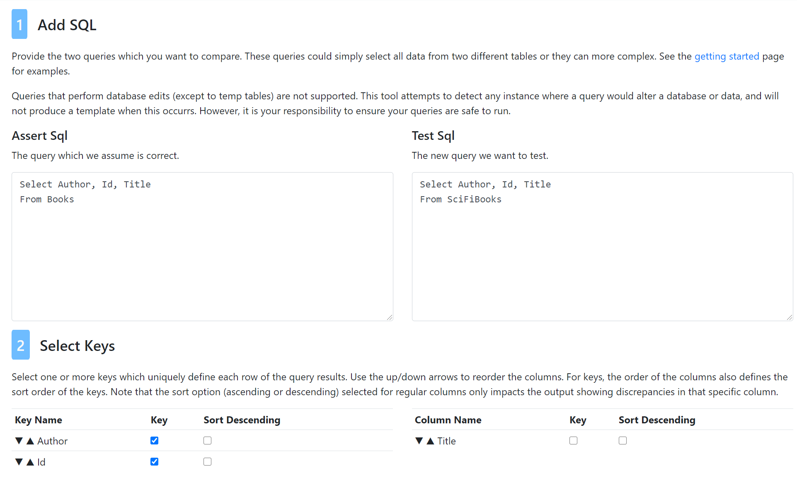

- [Usage Guide](#usage-guide)
  - [Getting Started](#getting-started)
  - [Advanced Usage](#advanced-usage)
    - [Key Selection](#key-selection)
    - [Cross Database Comparisons](#cross-database-comparisons)
    - [Cross Database or Server Comparisons](#cross-database-or-server-comparisons)
    - [Common Table Expressions](#common-table-expressions)
    - [Temp Tables](#temp-tables)
    - [Parameterized Queries](#parameterized-queries)
    - [Comparing Many Parameterized Query Results](#comparing-many-parameterized-query-results)
    - [Stored Procedures](#stored-procedures)

# Usage Guide

Below are some instructions on using the app. If you have questions not answered here, feel free to open an issue.

## Getting Started

As a simple example, lets create two tables to compare. As you can see these have the same structure, but have some deliberatly discrepant data.

To generate a comparison script:
1. Create these tables and data in a test database.

``` sql
-- Sample Data Source
Create Table Books
( Id int not null
 ,Author varchar(50) not null
 ,Title varchar(50) not null)

Create Table SciFiBooks
( Id int not null
 ,Author varchar(50) not null
 ,Title varchar(50) not null)

Insert into Books (Id, Author, Title)
Values (1, 'Martha Wells', 'All Systems Red')
      ,(2, 'Terry Mancour', 'Spellmonger')
      ,(3, 'Yahtzee Croshaw', 'Will Save the Galaxy for Food')
      ,(4, 'Andrew Rowe', 'Sufficiently Advanced Magic')
      ,(5, 'Brandon Sanderson', 'The Emperor''s Soul')
      ,(7, 'Lois McMaster Bujold', 'The Vor Game')

Insert into SciFiBooks (Id, Author, Title)
Values (1, 'Martha Wells', 'All Systems Red')
      ,(3, 'Yahtzee Croshaw', 'Will Save the Galaxy for Food')
      ,(4, 'Andrew Rowe', 'Sufficiently Advanced Magic')
      ,(5, 'Lois McMaster Bujold', 'The Warrior''s Apprentice')
      ,(6, 'Larry Niven', 'Ringworld')
      ,(7, 'Lois McMaster Bujold', 'Ceteganda')
```


2. Open the [web app][webapp].
3. Then paste the `Assert` and `Test` sql into the app.

``` sql
-- Assert
Select Id, Author, Title
From Books
-- Test
Select Id, Author, Title
From SciFiBooks
```

4. Select the `Id` column as a key.

 

5. Copy the comparison script.

 

6. Run the query in the test database. The output below will be produced.

As we can see, the query has correctly found the following:
* 3 rows are identical.
* Spellmonger is in `Books` but not `SciFiBooks`.
* Ringworld is in `SciFiBooks` but not `Books`.
* Two rows have discrepancies. The column specific discrepancy tables `Discrepant__Author` and `Discrepant__Title` show one and two discrepancies respectivly. 

 


## Advanced Usage 

Here are a few more advanced considerations.

### Key Selection

When choosing keys, you must pick at least one key and the key(s) you choose must be uniquely represent a row of the results. Once you met this requirement you can still select *more* columns as keys. 'Over defining' the keys can substantially alter the results of the comparison. This is particularly true when working on queries with complex joins. If we take the book query above, and compare using Id, or Auhtor and ID we get different results. As [discussed below](#comparing-many-parameterized-query-results), adding the extra key is equivelent to comparing the results of querying for each author one at a time. 

In the results, we can see that we now have more missing and extra columns. Discrepancies only show up where the author matches, as well as the key.

| Keys: Id | Keys: Author, Id |
| -------- | ------- |
|   |   |

### Cross Database Comparisons

So long as you have the appropriate permissions, you can compare results from multiple databases. To do this, use three part naming for all of the tables in the query. For example `[DatabaseA].[dbo].[TableA]`.

### Cross Database or Server Comparisons

You can compare data across servers, so long as you can query both from the same connection. This will require a linked server connection. **If the servers are not already linked, and especially if either is a production server, think very carefully before adding a link just to do a data comparison**. If servers are not linked, a better option may be to create links to both servers from a local SQLExpress instance running on your own machine. 

Cross server comparison requires four part naming for all of the tables in the query. For example `[ServerA].[DatabaseA].[dbo].[TableA]`.

### Common Table Expressions

Queries with CTEs work just fine.

### Temp Tables

If your queries produce intermediate results in temp tables, this is perfectly fine. The only consideration is that the two queries cannot create temp tables with the same names. If this is an issue, here are two options.

1. Drop the temp table(s) at the end of the `Assert` or the beginning of the `Test` sql.
2. If you want to share the temp table between the two queries. You can create the table only in the `Assert` query. Or you can paste it into the template after it is created. There is a section at the top of the template for this purpose.


Several temp table names are reserved for use by the app. 
* #Assert
* #Test
* #Matched
* #Discrepant
* #Discrepant__{TableName}
* #Extra
* #Missing

### Parameterized Queries

If paramaterized queries share the same parameter names, you can paste the parameter declarations into the template after it is created. There is a section at the top of the template for this purpose. This makes it easier to find and change the parameter as needed, than if you include it in the `Assert` or `Test` sql.

### Comparing Many Parameterized Query Results

If you need to compare the results from the query, with many different parameter inputs, there is a simpler option than running the query over and over with different inputs.

Consider the book queries in the getting started section above. We might parameterize the queries like this to get results by author. We would compare the results using `Id` as the key.

``` sql
Declare @Author Varchar(50) = 'Brandon Sanderson';

-- Assert
Select Id, Title
From Books
Where Author = @Author
-- Test
Select Id, Title
From SciFiBooks
Where Author = @Author
```

We can modify the queries to allow us to simulate the output of this query for every value of `@Author` that returns results. We do this by removing the parameter(s) and instead adding them to the select ed colums. We then also add the parameters to the beginning of the list of keys, so we now have `Author, Id` as keys. If your tables **are very large** you may want to be cautious about taking this approach from a performance perspective. A more performant option might be to create a temp table with a subset of authors to test, and add `where Author in (Select Author from #TestAuthors)` to the query.

``` sql
-- Assert
Select Author, Id, Title
From Books
-- Test
Select Author, Id, Title
From SciFiBooks
```

 

This yields quite a different result from the Getting Started example above, where only `Id` is key. See the output in [Key Selection](#key-selection)

### Stored Procedures

This tool does not directly support stored procedures. However, you can take the code from the stored procedures and run it as a [paramaterized query](#parameterized-queries).

[webapp]: https://sqldatacompare.mjconrad.com/